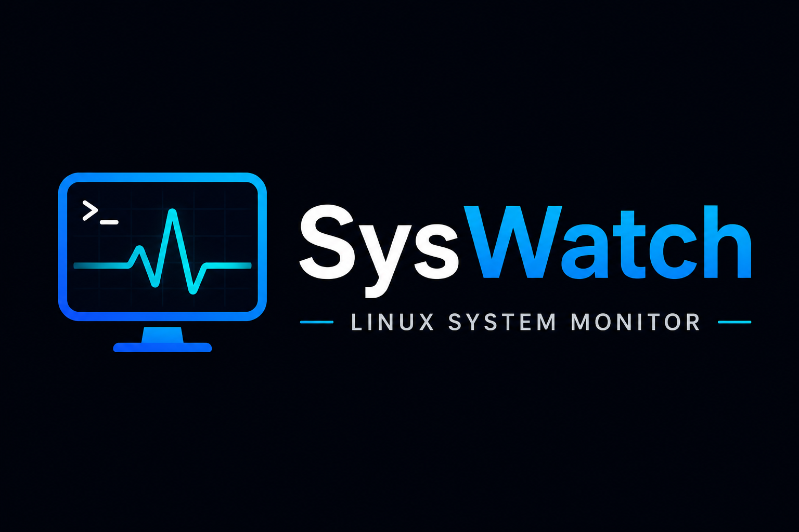
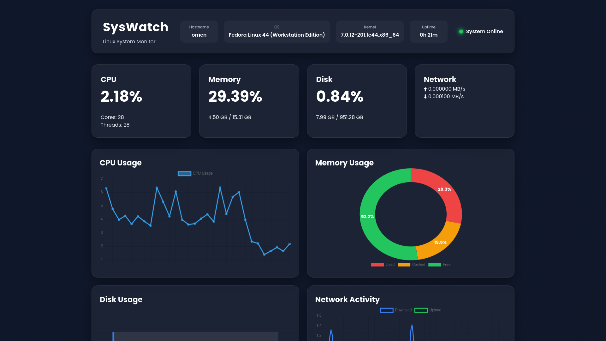
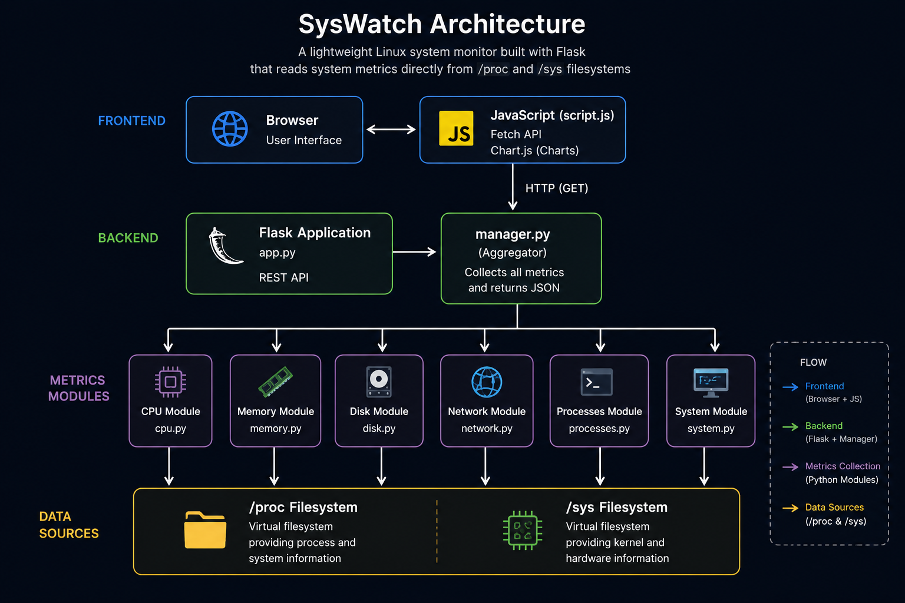
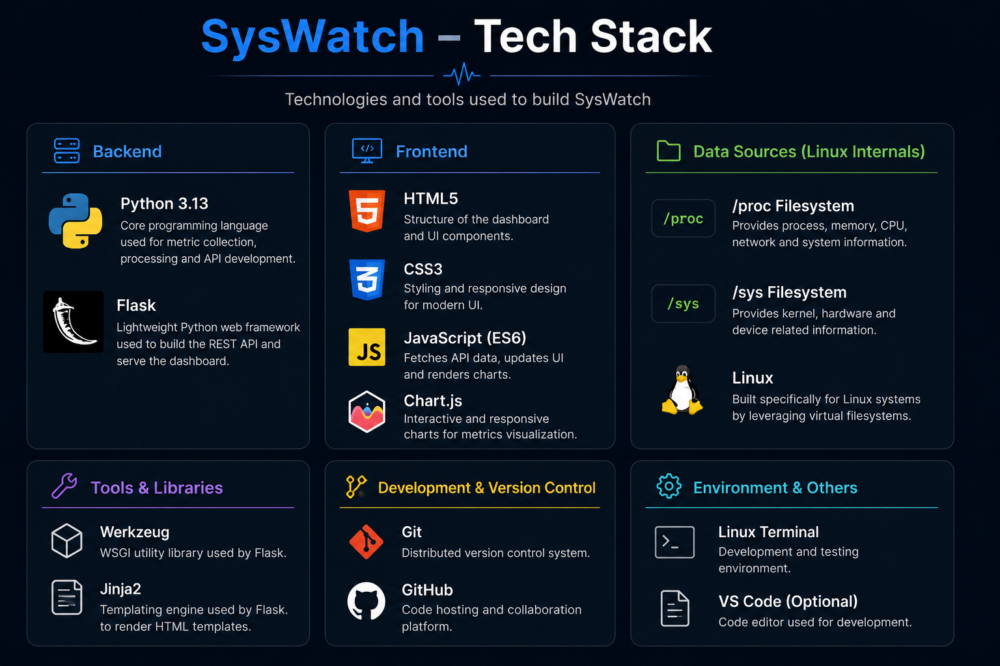
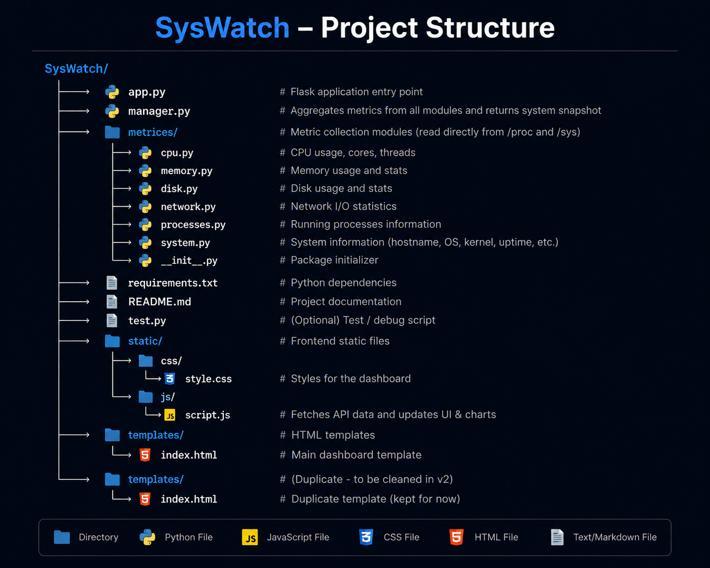

<div align="center">



# SysWatch

### Lightweight Linux System Monitoring Dashboard

**Monitor your Linux system in real time through a modern web dashboard powered by Flask.**

Built by reading directly from the Linux **`/proc`** and **`/sys`** virtual filesystems — **without relying on `psutil`**.

<br>


</div>

---


<p align="center">
  
</p>

--- 


<p align="center">
  <em>A modern Linux system monitoring dashboard providing live CPU, memory, disk, network, and process statistics.</em>
</p>
<p align="center">

--- 
## 👨‍💻 Author

**Prashast Mathur**

Computer Science Engineering Student  
IIIT Bhopal

If you found this project interesting, feel free to star the repository or connect with me.
--- 
## 📖 About

**SysWatch** is a lightweight web-based Linux system monitoring dashboard designed to provide real-time insights into system performance through an intuitive and responsive interface. The project was built to explore how Linux exposes system information through its virtual filesystems while creating a practical monitoring tool from the ground up.

Unlike many system monitoring applications that rely on high-level libraries such as **`psutil`**, SysWatch reads system metrics directly from the Linux **`/proc`** and **`/sys`** virtual filesystems. This approach provides a deeper understanding of Linux internals and demonstrates how the operating system exposes information about the CPU, memory, storage, network interfaces, running processes, and other system resources.

The backend is built with **Flask** and follows a modular architecture where dedicated Python modules collect different categories of system metrics. These metrics are aggregated through a central manager and exposed via a REST API. The frontend periodically retrieves this data using JavaScript's Fetch API and visualizes it through interactive charts, system cards, and a live process table.

SysWatch was developed as a systems programming project to strengthen my understanding of Linux internals, backend development, and full-stack application design while building a practical tool that showcases direct interaction with the operating system.
</p>

---

<p align="center>
## ✨ Features

- 🖥️ **System Overview**
  - Displays hostname, operating system, kernel version, uptime, and system status.

- ⚡ **CPU Monitoring**
  - Tracks live CPU utilization along with the number of physical cores and logical threads.

- 🧠 **Memory Monitoring**
  - Displays memory usage with detailed statistics and interactive visualizations.

- 💾 **Disk Monitoring**
  - Reports disk usage, available storage, and utilization percentage.

- 🌐 **Network Monitoring**
  - Monitors real-time upload and download speeds across network interfaces.

- 📈 **Interactive Charts**
  - Visualizes CPU, memory, disk, and network activity using dynamic Chart.js graphs.

- 🔍 **Process Explorer**
  - Lists running processes with PID, CPU usage, memory consumption, and process state.

- 🔄 **Live Updates**
  - Continuously refreshes system metrics through asynchronous API requests without requiring page reloads.

- 🐧 **Linux Native**
  - Collects data directly from the Linux **`/proc`** and **`/sys`** virtual filesystems without relying on external monitoring libraries.
  </p>
  ---
  ## 🏗️ Architecture

<p align="center">
    
</p>

SysWatch follows a modular client-server architecture where the frontend communicates with a Flask backend to retrieve live system metrics. The backend gathers data through dedicated metric collection modules that read directly from the Linux **`/proc`** and **`/sys`** virtual filesystems.

### Data Flow

1. The browser loads the dashboard and periodically requests updated system information.
2. Flask exposes REST API endpoints that serve the latest system metrics.
3. The central `manager.py` coordinates all metric collection modules.
4. Individual modules gather CPU, memory, disk, network, process, and system information directly from the Linux kernel interfaces.
5. The collected data is returned as JSON and rendered dynamically using JavaScript and Chart.js.
---
## 🛠️ Tech Stack

<p align="center">
    
</p>

| Category | Technologies |
|-----------|--------------|
| **Backend** | Python, Flask |
| **Frontend** | HTML5, CSS3, JavaScript |
| **Visualization** | Chart.js |
| **Operating System** | Linux |
| **Data Sources** | `/proc`, `/sys` |
| **Version Control** | Git, GitHub |
---
## 📂 Project Structure

<p align="center">
    
</p>

```text
SysWatch/
├── app.py                  # Flask application entry point
├── manager.py              # Aggregates all system metrics
├── requirements.txt        # Project dependencies
│
├── metrices/
│   ├── cpu.py              # CPU metrics
│   ├── memory.py           # Memory metrics
│   ├── disk.py             # Disk usage metrics
│   ├── network.py          # Network statistics
│   ├── processes.py        # Running process information
│   └── system.py           # System information
│
├── static/
│   ├── css/
│   │   └── style.css
│   └── js/
│       └── script.js
│
├── templates/
│   └── index.html
│
├── assets/
│   ├── logo.png
│   ├── dashboard.png
│   ├── architecture.png
│   ├── tech_stack.png
│   └── project_structure.png
│
└── README.md
```
--- 
## 🚀 Installation

### Prerequisites

Before running SysWatch, ensure you have the following installed:

- Python 3.10 or later
- Git
- A Linux-based operating system

### Clone the Repository

```bash
git clone https://github.com/ValueError811/SysWatch.git

cd syswatch
```

### Create a Virtual Environment

```bash
python3 -m venv venv
```

### Activate the Virtual Environment

```bash
source venv/bin/activate
```

### Install Dependencies

```bash
pip install -r requirements.txt
```

--- 
## ▶️ Running the Application

Start the Flask development server:

```bash
python app.py
```

Open your browser and navigate to:

```text
http://127.0.0.1:5000
```

The dashboard will begin displaying live system metrics retrieved directly from the Linux `/proc` and `/sys` virtual filesystems.

--- 

## 🔌 REST API

The frontend communicates with the Flask backend through the following endpoint.

| Method | Endpoint | Description |
|---------|----------|-------------|
| GET | `/api/system` | Returns the latest system metrics in JSON format. |

---

## 📚 Learning Outcomes

Building SysWatch helped me gain hands-on experience with:

- Linux virtual filesystems (`/proc` and `/sys`)
- Systems programming concepts
- REST API development using Flask
- Modular Python application design
- Frontend and backend integration
- Real-time data visualization with Chart.js
- Parsing kernel-provided system information
- Organizing and documenting a full-stack project

---

## 🚀 Future Improvements

Some features planned for future versions include:

- GPU monitoring
- Temperature sensor support
- Historical performance graphs
- Docker deployment
- Export metrics to CSV/JSON
- Multiple dashboard themes
- Process management
- User authentication
- Alert and notification system

---

## 📄 License

This project is licensed under the MIT License.

See the `LICENSE` file for more information.
---